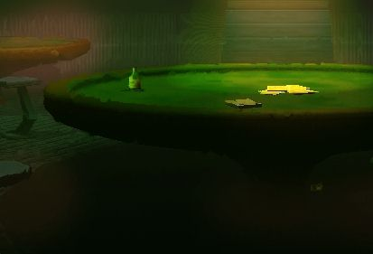

# Illusion Viewer 3.5

---

**Disclaimer:**

This is a legacy application that I do not own the rights to. I am only re-uploading it for archival purposes. The original authors are presumed to be long gone, and the source was taken from a Chinese website in 2004. All credits go to the original creators.

---

## Table of Contents

1. [Overview](#overview)
2. [Supported Games](#supported-games)
3. [Game Modifications - Image Replacement](#game-modifications---image-replacement)
4. [Game Modifications - Texture Coordinate Modification](#game-modifications---texture-coordinate-modification)
5. [Game Modifications - Model Vertex Coordinate Modification](#game-modifications---model-vertex-coordinate-modification)
6. [Removal of Image Mosaic](#removal-of-image-mosaic)
7. [Image Localization (Chinese Translation)](#image-localization-chinese-translation)
8. [Image Cartoonization Processing](#image-cartoonization-processing)

---

## Overview

### [v3.5 Update Notes]

- Bug fixes in unmatrix code, added scanning of unknown large files for images (supports JPEG, BMP, TGA), image mosaic removal, Ryvius image effects. Export of extracted image files and Illusion packed files.

---

## Supported Games

**IllusionViewer3.5** supports the following games:

- **Tail Chaser 2**
- **Train Wolf** (电车之狼)
- **DB4**
- **DBVR**
- **Sexy Beach 2**
- **Tail Chaser 3 DEMO** (尾行3 DEMO)

---

### Operation Method

**Selecting Objects:**
- Drag with the left mouse button.
- Hold `<Ctrl>` for inverse selection, hold `<Shift>` to add to the selection set, hold `<Alt>` to remove from the selection set.

**Camera Panning:**
- Drag with the middle mouse button.
- Shift + Right mouse button drag.

**Camera Rotation:**
- Alt + Middle mouse button drag.
- Alt + Right mouse button drag.

### Shortcut Keys

- **Space Bar** - Focus the viewpoint on the selected object.
- **9** - Hide selected object
- **0** - Unhide object
- **A** - Center all objects
- **V** - Wireframe mode
- **Alt + Enter** - Toggle fullscreen mode

- It is recommended to use Deep Exploration to browse VRML; you can import it into 3dsmax 4.0 for editing.
- For any questions or suggestions about this software, please leave a message in the 3D Technology/Program section at [www.3dhgame.net/bbs](http://www.3dhgame.net/bbs).

---

## Game Modifications - Image Replacement

For example, if you need to modify the color of the main character's skirt in the Tail Chaser 3 DEMO, follow these steps:

1. Import the scene.
2. Select the model to modify (`bk3_02.tbl -> h01_70.x`).
3. Double-click on the skirt. The corresponding texture will display in the **Image Viewer**.
4. Use **Save Image** to export it.
5. Open the exported image in Photoshop and modify the skirt's color.
6. Click the **Open Image** icon to load the modified image.
7. Use **Replace Image** to save the changes.

After these steps, you will see the modifications in the game.

---

## Game Modifications - Texture Coordinate Modification

*Support for this feature will be added in future versions.*

---

## Game Modifications - Model Vertex Coordinate Modification

Currently, only overall scaling of all vertices in the model is supported.

**Example:**

To change the size of a car in the Tail Chaser 3 DEMO:

1. Import the scene.
2. Select the nodes to modify (`Mesh_CAR2_K__ 0`, `Mesh_CAR2_K__ 1`, `Mesh_CAR2_K__ 2`).
3. Choose **Scale Up** or **Scale Down**.
4. Click **Save Changes**.

*Support for dragging individual vertices will be added in future versions.*

**Note:** This modification primarily targets game model file formats after the Tail Chaser 3 Demo. Due to differences in the previous game save formats by Illusion, be sure to back up before making changes!

---

## Removal of Image Mosaic

### 1. Tutorial

#### 1.1 Obtain the Original Image

In this example, we first take a mosaic image from Illusion's homepage.

[Original Image](http://www.illusion.jp/preview/BK3/1121/H2/010.jpg)

#### 1.2 Edit in Photoshop

1. Open the file in Photoshop 5.0.
2. Create a new layer.
3. Select pure magenta (RGB 255, 0, 255).
4. Use the pencil tool to paint over the image as shown below.
5. Save it as a PSD file.

#### 1.3 Use IllusionViewer3.5 to Remove the Mosaic

1. Open the saved PSD file in IllusionViewer3.5 using **Image Viewer/Open Image**.
2. Select **Remove Mosaic** from the pop-up menu.
3. Wait a moment (22 seconds on a P3-600).
4. The processed image will appear as shown below.

### 2. Other Examples

**Example 1:**

- **Source:** [Image](http://www.illusion.jp/preview/BK3/1121/H2/009.jpg)
- **Left Image:** Unprocessed effect
- **Middle Image:** Result after editing in Photoshop
- **Right Image:** Effect after processing with IllusionViewer 3.5

**Example 2:**

- **Source:** Screenshot from DesBlood4 H animation (`v1020_00_02.bxn`)
- **Left Image:** Unprocessed effect
- **Middle Image:** Result after editing in Photoshop
- **Right Image:** Effect after processing with IllusionViewer 3.5

---

## Image Localization (Chinese Translation)

1. **Localizing images with a lot of Japanese text can be very tedious using traditional methods in Photoshop**, such as the image below from DesBlood4.

2. **First, extract the font's alpha channel.** In this example, the method used is to take the blue channel of the image in RGB mode, apply an overlay algorithm, and iterate three times to obtain the following image.

3. **Use IllusionViewer3.5 to Remove the Mosaic**

   1. Open the saved PSD file in IllusionViewer3.5 using **Image Viewer/Open Image**.
   2. Select **Remove Mosaic** from the pop-up menu.
   3. Wait a moment to obtain the processed image as shown below.

---

### Programming Technical Background

This processing method was first proposed by Bertalmio at Siggraph 2000, referred to as **Inpainting**. IllusionViewer 3.5 is based on optimal speed, relying on Inpainting and Texture Synthesis.

**References:**

- [Bertalmio](http://www.ece.umn.edu/users/marcelo/restoration.html)
- [Hitoshi Yamauchi](http://www.mpi-sb.mpg.de/~hitoshi/research/image_restoration/index.shtml)

---

## Image Cartoonization Processing

1. **Load an image into IllusionViewer3.5** using **Image Viewer**.

2. **Select [Cartoon Effect]** from the pop-up menu and wait a moment to obtain the processed image as shown below.

### Programming Technical Background

This processing method is very similar to the memory effect in the award-winning Japanese animated film *Ryvius* from 1997. It primarily utilizes fast Gaussian blur and ColorBurn color blending effects for edge processing, then mixes it with the original image.

---

**3D Model and Image Copyright Reserved to ILLUSION SOFT LTD!!!**

**3DH Game Studio** ([www.3dhgame.net](http://www.3dhgame.net))  
by [nightscg](mailto:nightscg@21cn.com).  
2004/1/10
